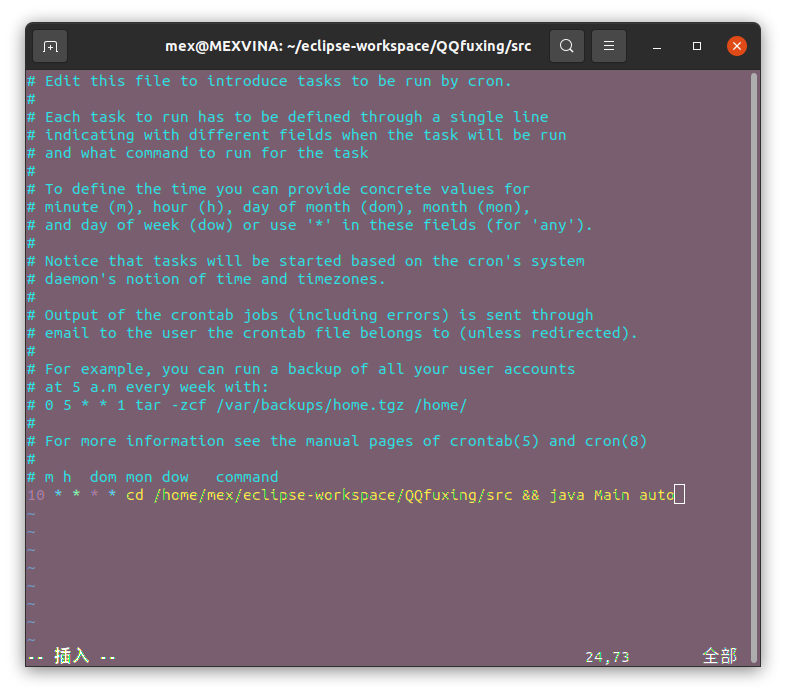

# QQ福星

- 开发环境：ubuntu 20.04 (jdk 17)

- window 系统可能无法运行，未测试

- 使用前请确保脚本第12行的“虎头”坐标与你手机的坐标一致。“立即前往”按钮的坐标会通过ocr获取。

- QQ会不定时修改福星收集的入口！

#### 介绍
<strike>每隔一段时间</strike>自动收集QQ福星

#### 展示

#### 安装教程

1.  克隆项目`git clone https://gitee.com/vinamex/qq-fuxing.git`
2.  安装软件`sudo apt-get install -y tesseract-ocr libtesseract-dev tesseract-ocr-chi-sim openjdk-17-jdk`
3.  进入项目`cd qq-fuxing/src`
4.  编译`javac Main.java`
5.  手机通过数据线连接电脑，并允许此电脑进行usb调试，运行`java Main on`进行初始化，然后拔下数据线即可
6.  使用crontab定时运行：

    `sudo crontab -e`

    具体语法可参考https://www.runoob.com/linux/linux-comm-crontab.html
    
    例如：我的class文件在`/home/mex/eclipse-workspace/QQfuxing/src/Main.class`

       我的手机ip为:`192.168.0.100:5555`(默认为5555端口)

       我希望每小时的15分运行，则代码为：

       `15 * * * * cd /home/mex/eclipse-workspace/QQfuxing/src && java Main auto` 
       (其中`auto`可以写成`192.168.0.100:5555`，不过还是推荐写成`auto`)
       
       
       注意这样是错误的:
       

       具体原因可参考:
       

#### 使用说明

1.  手机请打开 “usb调试” “usb无线调试” “允许通过usb调试修改权限或模拟点击”
2.  手机请关闭密码锁
3.  java Main (on/off/手机ip地址/auto)分别是启动并开启手机无线调试/关闭手机无线调试/通过wifi连接手机/自动判断
4.  运行日志见./info
5.  我尝试写了一个自动安装脚步(./it_cannot_install.sh),不过无法自动配置crontab
